# Zefir GUI Framework

Lightweight C++ GUI framework.

## Widget Gallery

| Widget | Screenshot | Description |
|--------|------------|-------------|
| **Button** | 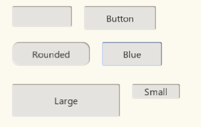 | Clickable button with text, hover/press animation |
| **Label** | 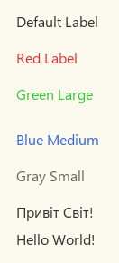 | Text with customizable font size and color |
| **TextBox** | 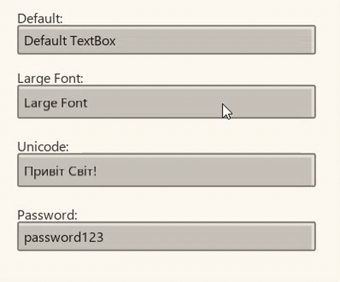 | Text input with cursor, Unicode support |
| **Slider** | 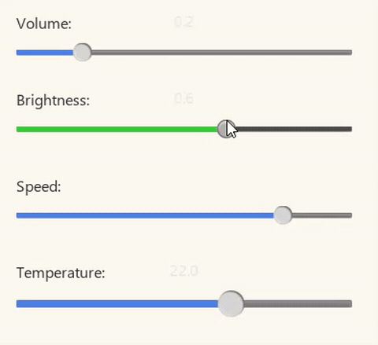 | Draggable slider with track fill |
| **CheckBox** | 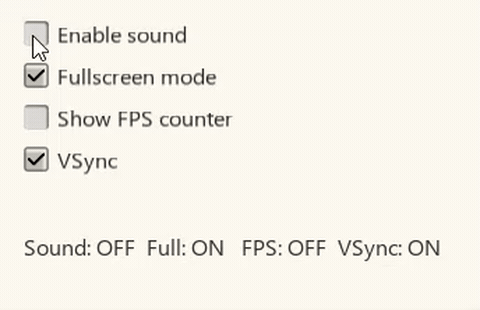 | Toggle with PNG checkmark |
| **RadioButton** | 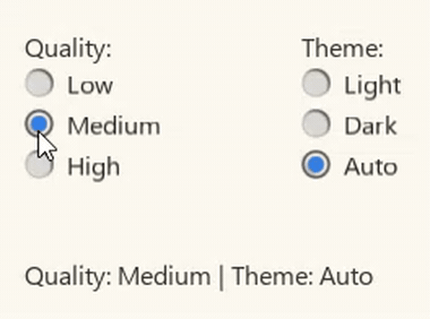 | Exclusive selection with dot indicator |
| **ComboBox** | 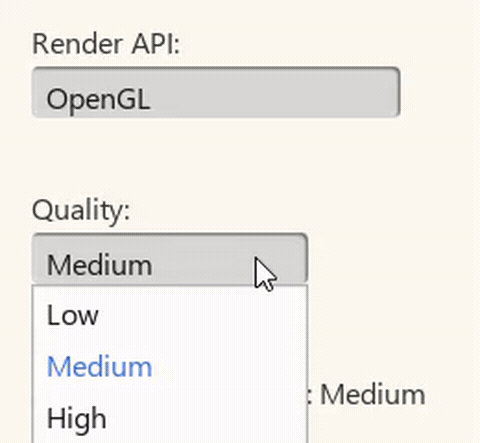 | Dropdown list with selection |
| **ProgressBar** | 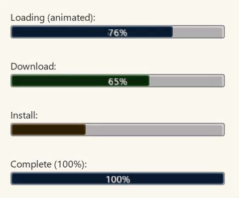 | Progress indicator with percentage |
| **TabView** | 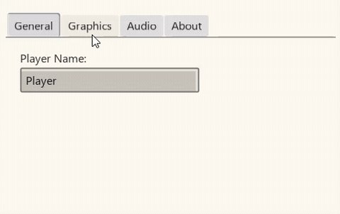 | Tabbed content panels |
| **ScrollBar** | 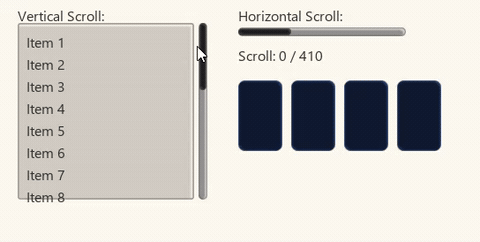 | Vertical/horizontal scroll |
| **MenuBar** | 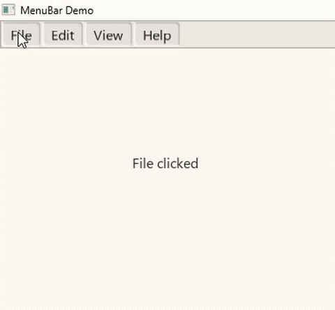 | Top menu bar with items |
| **ContextMenu** | 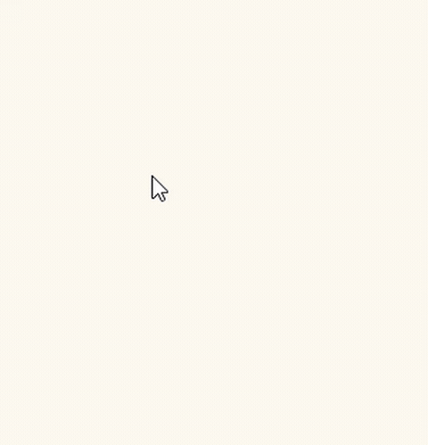 | Right-click popup menu |
| **Tooltip** | 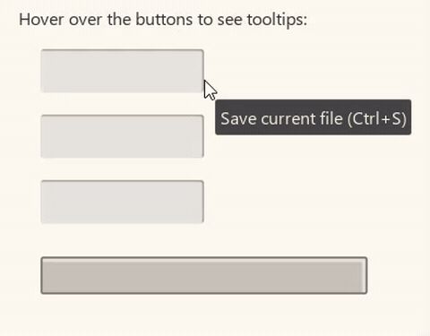 | Hover tooltip with delay |
| **Panel** | 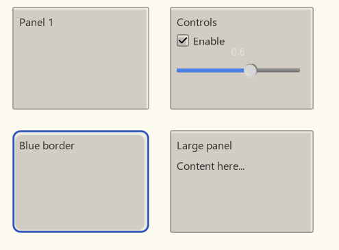 | Inset/depressed container |
| **Movable Window** | 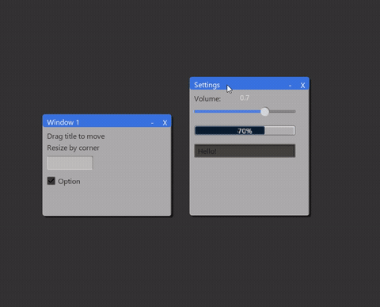 | Draggable, resizable window |
| **Texture Rect** | 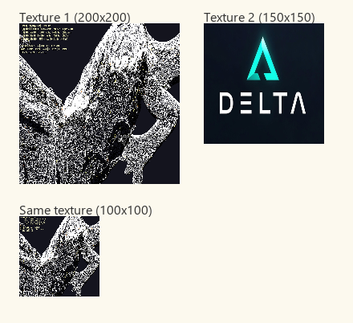 | Image display from file |
| **Viewport** | 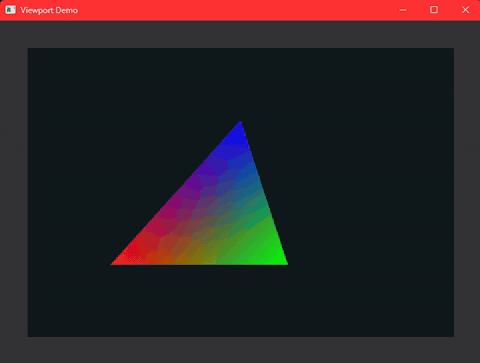 | Embedded child window |
| **Popup** | 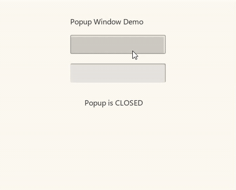 | Separate OS window |

## Quick Start

```cpp
#include <zefir.h>

int main() {
    ZefirContext* ctx = zefir_init("Window", 800, 600);
    zefir_set_background_color(ctx, 0.2f, 0.2f, 0.2f, 1);

    while (!zefir_should_close(ctx)) {
        zefir_begin_frame(ctx);
        zefir_label(ctx, "Hello!", 50, 50);
        zefir_end_frame(ctx);
    }

    zefir_shutdown(ctx);
    return 0;
}
```

## Build


### Powershell
```powershell
mkdir build
cd build
cmake ..
cmake --build . --config Release
```

Output:
- `build/zefir/libzefir.a` (static)
- `build/zefir/libzefir.dll` (shared)
- `build/demo/` (18 demos)

Options:
```powershell
cmake .. -DBUILD_DEMOS=OFF -DBUILD_SHARED=OFF
```

## Core API

| Function | Description |
|----------|-------------|
| `zefir_init(title, w, h)` | Create window, returns context |
| `zefir_shutdown(ctx)` | Destroy window |
| `zefir_should_close(ctx)` | Returns true when window closed |
| `zefir_begin_frame(ctx)` | Start frame (clear, poll input) |
| `zefir_end_frame(ctx)` | End frame (swap buffers) |
| `zefir_set_background_color(ctx, r,g,b,a)` | Set clear color (0.0-1.0) |
| `zefir_get_size(ctx, &w, &h)` | Get window dimensions |
| `zefir_get_mouse_pos(ctx, &x, &y)` | Get mouse position |
| `zefir_get_time(ctx)` | Get elapsed seconds |
| `zefir_is_hovering(ctx, x, y, w, h)` | True if mouse over rect |
| `zefir_mouse_clicked(ctx)` | True on left mouse release |
| `zefir_draw_rect(ctx, x, y, w, h, r,g,b,a)` | Draw filled rectangle |

## Widgets

### Button

```cpp
// Simple
bool clicked = zefir_button(ctx, x, y, w, h);

// Styled
ZefirButtonStyle s; zefir_get_default_button_style(&s);
s.text = "Click"; s.font_size = 16; s.corner_radius = 8;
bool clicked = zefir_button_ex(ctx, x, y, w, h, &s);
```

**Style fields:** `border_width`, `border_color[4]`, `highlight_color[4]`, `shadow_color[4]`, `corner_radius`, `press_offset`, `hover_brightness`, `press_darkness`, `text`, `font_size`, `text_color[4]`

**Demo:** `demo/button.cpp`

---

### Label

```cpp
zefir_label(ctx, "Text", x, y);

ZefirLabelStyle s; zefir_get_default_label_style(&s);
s.color[0] = 1; s.color[1] = 0; s.color[2] = 0; // Red
s.font_size = 24;
zefir_label_ex(ctx, "Red", x, y, &s);
```

**Demo:** `demo/HelloWorld.cpp`

---

### TextBox

```cpp
char buf[256] = "";
zefir_textbox(ctx, x, y, w, h, buf, 256);
```
Supports Unicode input (Cyrillic, Ukrainian). Each field has independent state.

**Demo:** `demo/form.cpp`, `demo/login.cpp`

---

### Slider

```cpp
float val = 0.5f;
val = zefir_slider(ctx, x, y, w, h, val, 0.0f, 1.0f);
```

**Demo:** `demo/slider.cpp`, `demo/mixer.cpp`

---

### CheckBox

```cpp
bool checked = false;
zefir_checkbox(ctx, x, y, "Option", &checked);
```
Uses embedded PNG checkmark icon.

**Demo:** `demo/checkbox.cpp`

---

### RadioButton

```cpp
int selected = 0;
zefir_radio(ctx, x, y, "A", &selected, 0);
zefir_radio(ctx, x, y, "B", &selected, 1);
```

**Demo:** `demo/settings.cpp`

---

### ComboBox

```cpp
const char* items[] = {"OpenGL", "Vulkan", "DirectX"};
int sel = 0;
ZefirComboStyle s; zefir_get_default_combo_style(&s);
sel = zefir_combo(ctx, x, y, w, items, 3, &sel, &s);
```

**Demo:** `demo/showcase.cpp`

---

### ProgressBar

```cpp
float progress = 0.65f;
ZefirProgressStyle s; zefir_get_default_progress_style(&s);
zefir_progress_bar(ctx, x, y, w, progress, &s);
```

**Demo:** `demo/dashboard.cpp`

---

### TabView

```cpp
const char* tabs[] = {"Tab1", "Tab2"};
int active = 0;
ZefirTabViewStyle s; zefir_get_default_tabview_style(&s);
zefir_tabview_begin(ctx, x, y, w, h, tabs, 2, &active, &s);
// Content for active tab...
zefir_tabview_end(ctx);
```

**Demo:** `demo/settings.cpp`

---

### ScrollBar

```cpp
float scroll = 0;
ZefirScrollBarStyle s; zefir_get_default_scrollbar_style(&s);
scroll = zefir_scrollbar_v(ctx, x, y, w, h, &scroll, content_h, view_h, &s);
scroll = zefir_scrollbar_h(ctx, x, y, w, h, &scroll, content_w, view_w, &s);
```

**Demo:** `demo/todo.cpp`

---

### Menu Bar

```cpp
zefir_menu_bar_begin(ctx);
if (zefir_menu_item(ctx, "File")) { /* ... */ }
if (zefir_menu_item(ctx, "Edit")) { /* ... */ }
zefir_menu_bar_end(ctx);
```

**Demo:** `demo/showcase.cpp`

---

### Context Menu (right-click)

```cpp
if (zefir_context_menu_begin(ctx)) {
    if (zefir_context_menu_item(ctx, "Copy")) { /* ... */ }
    zefir_context_menu_separator(ctx);
    if (zefir_context_menu_item(ctx, "Delete")) { /* ... */ }
    zefir_context_menu_end(ctx);
}
```

**Demo:** `demo/showcase.cpp`

---

### Tooltip

```cpp
zefir_tooltip(ctx, "Help text", x, y);
```

**Demo:** Appears on hover in showcase.

---

### Popup (separate window)

```cpp
void* popup = zefir_popup_create("Title", 400, 300);
// ... use in loop ...
zefir_popup_destroy(popup);
```

**Demo:** `demo/windowmanager.cpp`

---

### Movable Window

```cpp
ZefirGuiWindow* win = zefir_window_create("Title", x, y, w, h);
if (zefir_window_begin(win, ctx)) {
    float wx, wy;
    zefir_window_get_pos(win, &wx, &wy);
    // Widgets at wx+offset, wy+offset...
    zefir_window_end(win, ctx);
}
```
Drag title bar to move, drag bottom-right to resize. Buttons: - collapse, ✕ close.

**Demo:** `demo/windowmanager.cpp`, `demo/showcase.cpp`

---

### Viewport (embedded 3D window)

```cpp
ZefirViewport* vp = zefir_viewport_create(ctx, x, y, w, h);
zefir_viewport_begin(vp);
// OpenGL rendering...
zefir_viewport_end(vp);
```
Creates child HWND for Vulkan/DirectX/OpenGL. Get HWND via `zefir_viewport_get_native_handle`.

---

### Texture Rect

```cpp
unsigned int tex = zefir_load_texture("image.png");
zefir_texture_rect(ctx, tex, x, y, w, h);
```
Supports PNG, JPG, BMP via stb_image.

**Demo:** Load any image and display.

---

## Layout System

Automatic widget positioning without manual coordinates.

```cpp
ZefirLayout* vbox = zefir_layout_create(x, y, w, h, 1); // 1=VBox, 0=HBox
zefir_layout_set_spacing(vbox, 8);
zefir_layout_set_padding(vbox, 10, 10);

zefir_layout_begin(vbox);
float wx, wy, ww, wh;
while (zefir_layout_next(vbox, &wx, &wy, &ww, &wh, 35)) {
    zefir_button(ctx, wx, wy, ww, wh);
}
zefir_layout_end(vbox);
zefir_layout_destroy(vbox);
```

**Demo:** `demo/layout.cpp`

---

## Themes

5 built-in themes. Apply to all widgets at once.

```cpp
ZefirTheme theme;
zefir_theme_get_dark(&theme);
zefir_theme_apply(&theme);
zefir_set_background_color(ctx, theme.bg_color[0], ...);

// Or get individual widget styles
ZefirButtonStyle bs;
zefir_theme_get_button_style(&theme, &bs);
```

**Themes:** `get_light`, `get_dark`, `get_ocean`, `get_forest`, `get_sunset`

**Demo:** `demo/themes.cpp`

---

## Demo Applications (18 total)

| Demo | Description | Widgets Used |
|------|-------------|--------------|
| `HelloWorld` | Minimal window | Label |
| `button` | Click counter, styled buttons | Button, Label |
| `form` | Text input form | TextBox, Button, Label |
| `slider` | Three sliders | Slider, Label |
| `checkbox` | Toggle options | CheckBox, Label |
| `settings` | Tabbed settings | TabView, TextBox, Radio, Checkbox, Slider |
| `login` | Login form | TextBox, Button, Label |
| `mixer` | Volume mixer | Slider, Button, Label |
| `todo` | To-do list | TextBox, Button, Checkbox, ScrollBar |
| `color` | Color picker | Slider, Label, Button, draw_rect |
| `mediaplayer` | Media player UI | Button, ProgressBar, Slider, Label |
| `calculator` | Calculator | Button, Panel, Label |
| `json_editor` | Settings editor | Slider, Button, Label |
| `layout` | VBox/HBox demo | Layout, Button, Checkbox, Radio, Slider, Progress |
| `dashboard` | System monitor | Panel, ProgressBar, Label, draw_rect |
| `windowmanager` | 4 movable windows | Window, Button, Slider, Progress, Checkbox |
| `themes` | Theme switcher | Button, Slider, Checkbox, TextBox, Panel |
| `showcase` | All widgets | Menu, ContextMenu, Window, Button, Checkbox, Radio, ComboBox, Progress, Slider, TextBox, TabView |

# Uses open-source libraries
- [stb](https://github.com/nothings/stb)
- [freetype](https://github.com/freetype/freetype) 